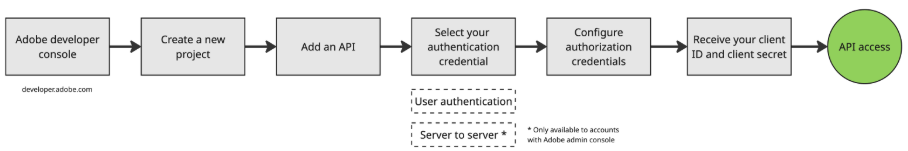

# Accounts, Projects, and Workspaces

## All Account Access

All Frame V4 accounts—not just those managed via the Adobe Admin Console—can create tokens and access the V4 API. Customers and partners can test, build, and refine their workflows using our newest API features.

**Create User Authentication Token**

1. Visit Adobe developer console to create a user authentication token. The user must use the same Adobe ID as their Frame login to validate API token access.

**Create API Credentials**

3. Once you have access to the APIs, the next step is to create API credentials, or an API token, to communicate with Frame. Create your API credentials at developer.adobe.com.

All V4 accounts, whether Frame-managed (V4F) or Adobe-managed (V4A) have access to create a Project in the Adobe Developer Console, and then create credentials. Once you have a set of credentials (OAuth Client ID/Client Secret), you can integrate with the Adobe Developer Platform’s three-legged OAuth flow. Sign in to your Adobe Identity to receive a valid auth and refresh token to make requests to the Frame.io V4 Developer API!

## Projects and Workspaces

### Workspace Updates

The Frame.io  landing page is new and named the Workspace page.  Users can browse Workspaces and Projects they have access to in an account. Thanks to this new design, it's easier to see who belongs to a given Workspace and quickly invite new people.

> Note: In Frame V3 Workspaces were known as Teams.

Workspaces are set to Invite Only in V4 meaning that users will only see the Workspaces they were explicitly invited to. Furthermore, there is no Team Directory page in account settings. Use the new Create, Delete, List and Update Workspace Permissions endpoints to manage Workspace permissions and related operations.

* List user roles for a given Workspace.
* Remove a user from a given Workspace.
* Update user roles for the given workspace if the user is already added to the workspace. If the user is not added to the workspace, the user will be added with the given role.

### Project Updates

The Project creation flow is updated with V4. Now, when you start a new Project, you choose between a blank Project or a Project Template. There are twelve templates to choose from to kickstart common creative Workflows. And you have the option to include the demo assets in the template, or start with just the Project template structure. Choosing a Project template immediately creates a new Project in your Workspace.

In general, the project creation flow has been updated with V4. When you start a new Project, users will be able to choose to start a blank project or use a Project Template. Use the new List, Remove, and Update Project Permissions endpoints to manage Project permissions and related operations.

* List user roles for a given project.
* Remove a user from a given project.
* Update User Roles for the given project if the user is already added to the project. If the user is not added to the project, the user will be added with the given role.
