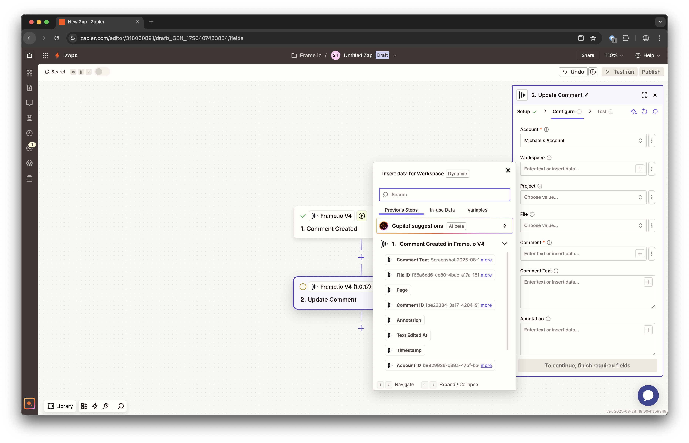

# Authorization to File Upload Guide

This guide describes the authorization to file upload flow for the Frame.io V4 API.  

## Prerequisites

* [Overview of Adobe Developer Console](https://developer.adobe.com/developer-console/docs/guides/)
* [How To Refresh Access Tokens](https://developer.adobe.com/developer-console/docs/guides/authentication/UserAuthentication/ims#refreshing-access-tokens)
* [How To Upload a New File](https://developer.adobe.com/developer-console/docs/guides/)
* [Fetching Access tokens](https://developer.adobe.com/developer-console/docs/guides/authentication/UserAuthentication/ims#fetching-access-tokens)
* [Uploading a New File](https://developer.adobe.com/frameio/guides/#uploading-a-new-file)

## Adobe Authorization

Follow the guidance on the Adobe Developer Console [Authentication Guide](https://developer.adobe.com/developer-console/docs/guides/authentication/) to join and build with the Frame.io V4 API safely. Follow the steps in [Getting Started with the Adobe Developer Console](https://developer.adobe.com/developer-console/docs/guides/getting-started/) to create an Adobe Developer Console Project with a Frame.io API subscription configured with the appropriate credential type for your application.

## Credential and Token creation

View, add, and manage credentials required for your application to connect safely and securely to external services. Configure your event registration to access authentication credentials. This could be a OAuth Server-to-Server credential or OAuth User authentication credential, depending on the type of event being configured.

## Add an API

Using APIs allows your application to make calls to Adobe services by means of a REST API. APIs can be connected to your app in multiple ways, depending on the API or the type of app that you are building. To learn more about each of these authentication methods or API connections, read the [authentication documentation](https://developer.adobe.com/developer-console/docs/guides/authentication/).

* [Add an API using OAuth Server-to-Server credential](https://developer.adobe.com/developer-console/docs/guides/services/services-add-api-oauth-s2s)
* [Add an API using OAuth User authentication credential](https://developer.adobe.com/developer-console/docs/guides/services/services-add-api-oauth-user-authentication)
* [Add an API using API Key authentication](https://developer.adobe.com/developer-console/docs/guides/services/services-add-api-key)

## Upload a New File

There are two ways to upload a new file: `Create File (local upload)` and `Create File (remote upload)`.

**Local Upload**

To create a file through local upload, select the **Create File (local upload)** endpoint. The request body requires the file name and its file size.



* If the request is successful, a placeholder file resource is created without any content. Depending on the file size, the response body will include one or more `upload_urls`. See [Multi-part Upload](#multi-part-upload) for next steps.


**Remote Upload**

To create a file through remote upload, select the **Create File (remote upload)** endpoint. The request body requires the file name and its source url.


* If the request is successful, the file appears in the UI.


## Multi-part Upload  

After creating a placeholder file through the **Create File (local upload)** endpoint, you will have one or more upload urls. These upload urls are required to make upload requests. It may be useful to compose a shell script that splits up the source file into chunks and issues the same number of subsequent requests.

> **NOTE:** These are important details to keep in mind when sending the subsequent upload requests.

> * The HTTP request method must be `PUT`.
> * The `x-amz-acl` header must be included and be set to private.
> * The `Content-Type` header must match the `media_type` specified in the original **Create File (local upload)** request. This is true even when uploading the file as separate parts.

In the sample Python script below, we're passing in one upload url in the `upload_urls` parameter, though as noted above, you may have more than one provided to you based on the file size set in the request body for **Create File (local upload).**

``` python
import requests
import math
from typing import List
from tqdm import tqdm  # For progress bar

def upload_file_in_chunks(file_path, upload_urls, chunk_size) -> bool:
    """
    Upload a file in chunks using presigned URLs.
    """
    try:
        # Get file size
        with open(file_path, 'rb') as f:
            f.seek(0, 2)  # Seek to end of file
            file_size = f.tell()
        
        # Calculate chunk size if not provided
        if chunk_size is None:
            chunk_size = math.ceil(file_size / len(upload_urls))
        
        print(f"File size: {file_size} bytes")
        print(f"Chunk size: {chunk_size} bytes")
        print(f"Number of chunks: {len(upload_urls)}")
        
        # Upload each chunk
        with open(file_path, 'rb') as f:
            with tqdm(total=len(upload_urls), desc="Uploading chunks") as pbar:
                for i, url in enumerate(upload_urls):
                    start_byte = i * chunk_size
                    end_byte = min(start_byte + chunk_size, file_size)
                    
                    # Read chunk from file
                    f.seek(start_byte)
                    chunk = f.read(end_byte - start_byte)
                    
                    # Upload chunk
                    response = requests.put(
                        url,
                        data=chunk,
                        headers={
                            'Content-Length': str(len(chunk)),
                            'Content-Type': 'image/jpeg',
                            'X-Amz-Acl': 'private'
                            }
                    )
                    
                    if response.status_code != 200:
                        print(f"Failed to upload chunk {i+1}. Status code: {response.status_code}")
                        return False
                    
                    pbar.update(1)
        
        return True
    
    except Exception as e:
        print(f"Error during upload: {str(e)}")
        return False

# Example usage
if __name__ == "__main__":
    # Replace these with your actual values
    file_path =  "/Users/MyComputer/local_upload/sample.jpg"  # Path to your file
    upload_urls = ["https://frameio-uploads-development.s3-accelerate.amazonaws.com/uploads/10e35b09-7e07-43a1-bd43-897f252ab627/original.png?..."]
    # Optional: specify chunk size in bytes (e.g., 10MB = 10 * 1024 * 1024)
    chunk_size = 10 * 1024 * 1024  # 10MB
    
    print("Starting file upload...")
    success = upload_file_in_chunks(file_path, upload_urls, chunk_size)
    
    if success:
        print("File upload completed successfully!")
    else:
        print("File upload failed!")
```
