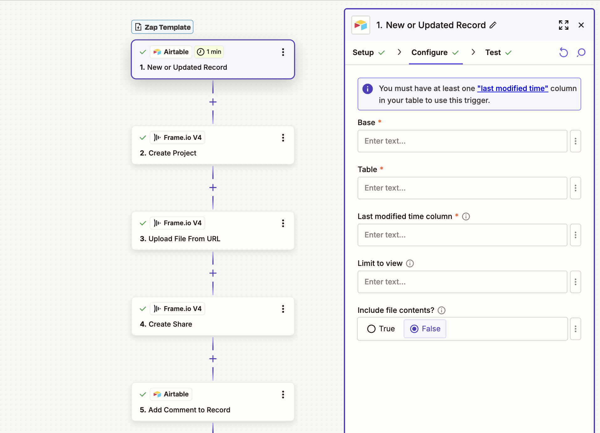

# Authorization to File Upload Guide

This guide describes the authorization to file upload flow for the Frame.io V4 API.  

## Prerequisites

1. You have a Frame.io V4 account administered via the [Adobe Admin Console](https://adminconsole.adobe.com/), OR you have [switched to Adobe authentication](https://help.frame.io/en/articles/11758018-connecting-to-adobe-authentication) for your account user
2. You have logged into the [Adobe Developer Console](https://developer.adobe.com/console) and have added the Frame.io API to a new or existing project
3. You have generated the [appropriate Authentication credentials](https://developer.adobe.com/frameio/guides/Authentication/) for your project
4. You have succfully used those credentials to generate an access token

## Choosing your upload method

There are two ways to upload a file using the Frame.io API: `Create File (local upload)` and `Create File (remote upload)`. The local endpoint would be used when the media is locally accessible to your application, similar to dragging a file from your desktop; the remote upload option would be used when the media is accessed over the network, such as through an intergration with another service. In this guide we'll start with the simpler case of completing a remote upload.

**Remote Upload**

To create a file through remote upload, select the **Create File (remote upload)** endpoint. The request body requires the file name and its source url.


* If the request is successful, the file appears in the UI.




**Local Upload**

To create a file through local upload, select the **Create File (local upload)** endpoint. The request body requires the file name and its file size.

```json
{ 
"data": {
    "name": "my_file.jpg",
    "file_size": 50645
  }
}
```


* If the request is successful, a placeholder file resource is created without any content. Depending on the file size, the response body will include one or more `upload_urls`. See [Multi-part Upload](#multi-part-upload) for next steps.


## Multi-part Upload  

After creating a placeholder file through the **Create File (local upload)** endpoint, you will have one or more upload urls. These upload urls are required to make upload requests. It may be useful to compose a shell script that splits up the source file into chunks and issues the same number of subsequent requests.

> **NOTE:** These are important details to keep in mind when sending the subsequent upload requests.

> * The HTTP request method must be `PUT`.
> * The `x-amz-acl` header must be included and be set to private.
> * The `Content-Type` header must match the `media_type` specified in the original **Create File (local upload)** request. This is true even when uploading the file as separate parts.

In the sample Python script below, we're passing in one upload url in the `upload_urls` parameter, though as noted above, you may have more than one provided to you based on the file size set in the request body for **Create File (local upload).**

``` python
import requests
import math
from typing import List
from tqdm import tqdm  # For progress bar

def upload_file_in_chunks(file_path: str, upload_urls: list[str], content_type: str | None = None, chunk_size: int | None = None) -> bool:
    """
    Upload a file in chunks using presigned URLs.
    """
    try:
        # Auto-detect content type based on file extension
        if content_type is None:
            detected_content_type, _ = mimetypes.guess_type(file_path)
            content_type = detected_content_type # Default fallback
        
        print(f"Detected content type: {content_type}")
        
        # Get file size
        with open(file_path, 'rb') as f:
            f.seek(0, 2)  # Seek to end of file
            file_size = f.tell()
        
        # Calculate chunk size if not provided
        if chunk_size is None:
            chunk_size = math.ceil(file_size / len(upload_urls))
        
        print(f"File size: {file_size} bytes")
        print(f"Chunk size: {chunk_size} bytes")
        print(f"Number of chunks: {len(upload_urls)}")
        
        # Upload each chunk
        with open(file_path, 'rb') as f:
            with tqdm(total=len(upload_urls), desc="Uploading chunks") as pbar:
                for i, url in enumerate(upload_urls):
                    start_byte = i * chunk_size
                    end_byte = min(start_byte + chunk_size, file_size)
                    
                    # Read chunk from file
                    f.seek(start_byte)
                    chunk = f.read(end_byte - start_byte)
                    
                    print(f"Uploading chunk {i+1}: {len(chunk)} bytes")
                    
                    # Upload chunk with minimal headers matching the signature
                    response = requests.put(
                        url,
                        data=chunk,
                        headers={
                            'content-type': content_type,  
                            'x-amz-acl': 'private'       
                        }
                    )
                    
                    if response.status_code != 200:
                        print(f"Failed to upload chunk {i+1}. Status code: {response.status_code}")
                        print(f"Response text: {response.text}")
                        print(f"Response headers: {dict(response.headers)}")
                        return False
                    else:
                        print(f"Chunk {i+1} uploaded successfully!")
                    
                    pbar.update(1)
        
        return True
    
    except Exception as e:
        print(f"Error during upload: {str(e)}")
        return False

# Example usage
if __name__ == "__main__":
    # Replace these with your actual values
    file_path =  "/Users/MyComputer/local_upload/sample.jpg"  # Path to your file
    upload_urls = ["https://frameio-uploads-development.s3-accelerate.amazonaws.com/uploads/10e35b09-7e07-43a1-bd43-897f252ab627/original.png?..."]
    # Optional: specify chunk size in bytes (e.g., 10MB = 10 * 1024 * 1024)
    content_type = "image/jpeg"
    chunk_size = 10 * 1024 * 1024  # 10MB
    
    print("Starting file upload...")
    success = upload_file_in_chunks(file_path, upload_urls, content_type, chunk_size)
    
    if success:
        print("File upload completed successfully!")
    else:
        print("File upload failed!")
```
