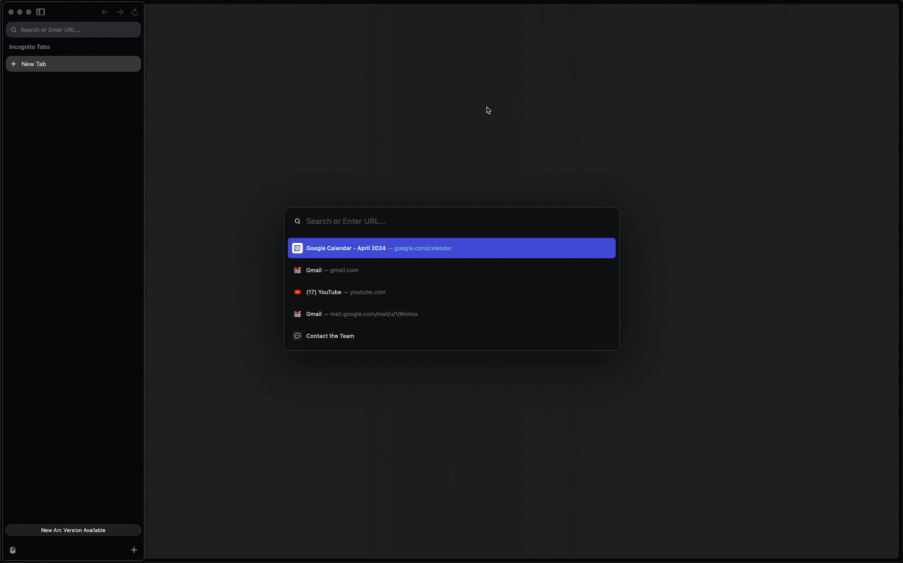
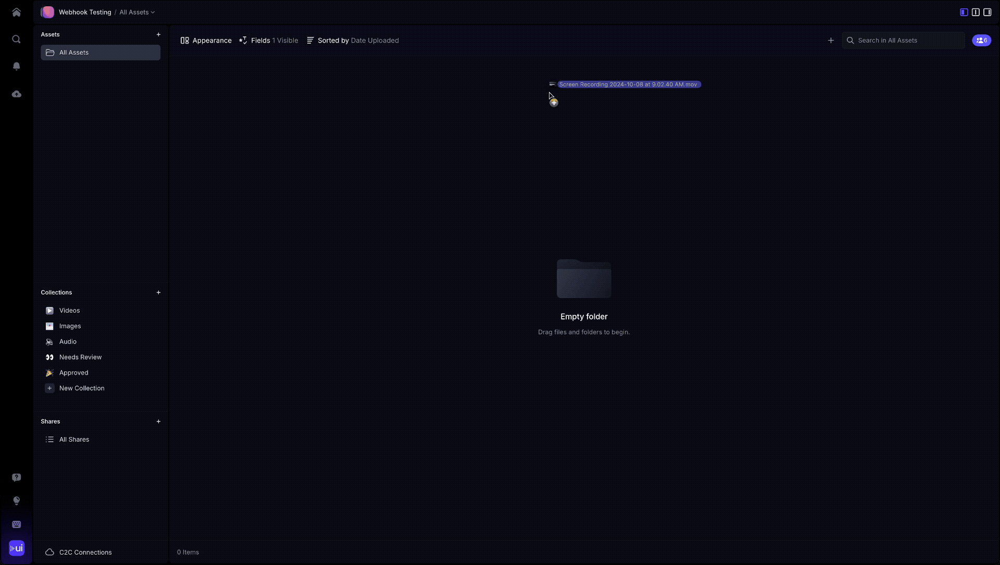

# V4 Webhooks

## What’s a Webhook?

A **webhook** is a push-style HTTP callback that Frame.io fires **as soon as something interesting happens** in your account (e.g., a new file finishes transcoding, a comment is added, a project is created).
Instead of polling the API, you supply a public HTTPS URL; Frame.io sends a JSON payload to that URL in real time so you can:

* Sync metadata to an external DAM/MAM
* Populate Slack channels or ticket systems

For more on what a webhook is, and what it does, see https://docs.webhook.site/.

## Endpoint Overview

|  ||  |
|---	|---	|---	|
|**Create** a webhook	|POST /v4/accounts/{account_id}/workspaces/{workspace_id}/webhooks	|Body with `name`, `url`, `events[]`	|
|**List** all webhooks for a workspace	|GET /v4/accounts/{account_id}/workspaces/{workspace_id}/webhooks	|Supports pagination	|
|**Show** one webhook	|GET /v4/webhooks/{webhook_id}	|Returns signing secret only at creation time	|
|**Update** a webhook	|PATCH /v4/webhooks/{webhook_id}	|Change `url`, `events`, or `is_active`	|
|**Delete** a webhook	|DELETE /v4/webhooks/{webhook_id}	|Immediately stops deliveries	|

Webhooks-guide
> 🔑 **Authentication** — All V4 endpoints require an OAuth 2.0 access token obtained through the Adobe Developer Console. Legacy developer tokens and JWTs are **not** accepted.

## Updates to Webhooks in Frame V4

* Added Account ID to the payload
* Renamed Team ID to be Workspace ID
* Split asset webhooks to file and folder webhooks

## Webhook Event Subscriptions

When creating and updating webhooks identify which events you’re interested in. Choose as few or as many as you’d like, note that the experience is better if you subscribe to fewer events, splitting up your webhooks logically with different naming schemes and different endpoints so that you can model your business logic on the receiving end to do less filtering and routing in shared functions.

> Event scope — All events are scoped to the Workspace provided during the creation of the webhook. This means events will be sent for actions taken in all projects in that Workspace.

### Projects

|Event	|Description	|
|---	|---	|
|`project.created`	|A new Project has been **created**	|
|`project.updated`	|A Project's settings are **updated**	|
|`project.deleted`	|A Project has been **deleted**	|

### Files

|Event	|Description	|
|---	|---	|
|`file.created`	|A File has been **created** in Frame.io. This does trigger before the file has actually been uploaded though so it will likely trigger before the file is fully uploaded - so keep that in mind depending on what you intend to do once you receive this event	|
|`file.ready`	|All transcodes have **completed**, after an file has been uploaded and processed	|
|`file.updated`	|A Files name, or other file information is changed	|
|`file.deleted`	|A File is **deleted** (manually or otherwise)	|
|`file.upload.completed`	|A File has been **uploaded**	|
|`file.versioned`	|A File version has been created	|

### Folders

|Event	|Description	|
|---	|---	|
|`folder.created`	|A new Folder has been **created**	|
|`folder.updated`	|A Folder's settings are **updated**	|
|`folder.deleted`	|A Folder has been **deleted**	|

### Comments

|Event	|Description	|
|---	|---	|
|`comment.created`	|A new Comment or Reply has been **created**	|
|`comment.updated`	|A Comment has been updated	|
|`comment.deleted`	|A Comment was **deleted**	|
|`comment.completed`	|A Comment was marked as **completed**	|
|`comment.uncompleted`	|A Comment was marked as **uncompleted**	|

### Metadata

|Event	|Description	|
|---	|---	|
|`metadata.value.updated`	|Metadata fields updated for an asset|

## Webhook Message Payload

All webhook payloads contain a `type` field, indicating the type of event that triggered a webhook, as well as a `resource` object. The `resource` object specifies the `type` and `ID` of the resource related to this event.

### Example Payload

```json
{
  "account": {
    "id": "6f70f1bd-7e89-4a7e-b4d3-7e576585a181"
  },
  "project": {
    "id": "7e46e495-4444-4555-8649-bee4d391a997"
  },
  "resource": {
    "id": "d3075547-4e64-45f0-ad12-d075660eddd2",
    "type": "file"
  },
  "type": "file.ready",
  "user": {
    "id": "56556a3f-859f-4b38-b6c6-e8625b5da8a5"
  },
  "workspace": {
    "id": "378fcbf7-6f88-4224-8139-6a743ed940b2"
  }
}
```

In the above example of an `file.created` event, the `resource.id` indicates the `id` of the newly created Asset. Additionally, `workspace`, `project`, and `user` objects are included. These resource identifiers indicate the `team.id`, `project.id` and `user.id` of the resource that the webhook relates to, and can be used to filter events on the receiving end of the incoming webhook without having to resort to making an API call to look up the resource. If you've implemented any sort of caching of those resources, you can also perform a local look up against your cache without resorting an additional API call.

**We do not include any additional information beyond the resource ID about the subscribed resource**.

 If your application requires additional information or context, we recommend making an API call to look-up more information about the resources being referenced.

## Security

By default, all webhooks have a signing key. This non-configurable signing secret can be used to verify that the request originates from Frame.io.

The response payload for the webhook you’ve configured includes the signing secret specific to this webhook. This secret is **only provided in this initial webhook create response**, so store it somewhere safe in your secrets storage or environment variables.  Use it later to verify the webhook is coming directly from our servers and was not intercepted or manipulated in any way.

### Verifying Webhook Signatures

To guard an integration against man-in-the-middle and replay attacks it is essential to verify the signature of the webhook payload. Verification ensures that webhook payloads were actually sent by Frame.io and payload content has not been modified in transport.

Included with the `POST` request are the following HTTP headers:

|Header Name	|Description	|Example	|
|---	|---	|---	|
|`X-Frameio-Request-Timestamp`	|The timestamp the request was sent	|`1604004499`	|
|`X-Frameio-Signature`	|The compute webhook signature	|`v0=a77ce6856e609c884575c2fd211d07a9ad1c3f72e19c06ff710e8f086ffca883`	|
|`user-agent: "Frame.io V4 API"`	|User agent in the header for v4	|	|
|`user-agent: "Frame.io Legacy API"`	|User agent in the header for Legacy	|	|

```python
import hmac
import hashlib

def verify_signature(curr_time, req_time, signature, body, secret):
    """
    Verify Webhook signature
    :Args:
        curr_time (float): Current epoch time
        req_time (float): Request epoch time
        signature (str): Signature provided by the Frame.io API for the given request
        body (str): Webhook body from the received POST
        secret (str): The secret for this Webhook that you saved when you first created it
    """
    if int(curr_time) - int(req_time) < 500:
        message = 'v0:{}:{}'.format(req_time, body)
        calculated_signature = 'v0={}'.format(hmac.new(
            bytes(secret, 'latin-1'),
            msg=bytes(message, 'latin-1'),
            digestmod=hashlib.sha256).hexdigest())
        if calculated_signature == signature:
            return True
    return False
```

**The timestamp** is the system time from Frame.io's systems when the outbound webhook is sent. This can be used to prevent [replay](https://en.wikipedia.org/wiki/Replay_attack) attacks. We recommended verifying this time is within 5 minutes of local time.

**The signature** is a HMAC SHA256 hash using the signing key provided when the Webhook is first created.

**Follow these steps to verify the signature:**

1. Extract the signature from the HTTP headers.
2. Create a message to sign by combining the version, delivery time, and request body: `v0:timestamp:body.`
3. Compute the HMAC SHA256 signature using your signing secret.
Webhooks-guide

>   The provided signature is prefixed with `v0=`. Currently Frame.io only has this one version for signing requests. Be sure this prefix is prepended to your computed signature.

4. Compare!

## Retries and Logging

* Five total attempts (initial + 4 retries)
* Exponential back-off starting at 15 s (+ jitter)
* A non-`2xx` status or >5 second timeout triggers the retry
* [Frame.io](http://frame.io/) keeps a **failure log** with: `webhook_id`, `account_id`, `event_type`, `resource_id`, `user_id`.

## Changes to Webhooks

Webhooks created in Legacy transfer to V4 with the following changes.

1. When creating a new webhook resource the `team_id` is no longer provided in the JSON payload, but that is instead in the path parameter of the URL: `https://api.frame.io/v4/accounts/:account_id/workspaces/:workspace_id/webhooks`.
2. Due to changes in API structure, endpoints, and authentication methods any existing code for incoming webhooks that makes subsequent calls to the Frame.io API for enrichment and look-up of resources require updating.
3. Since the asset webhooks have been split to Files and Folders, any webhooks coming from Legacy with asset events need to be updated to have the appropriate File and Folder events.

## Webhook Tutorial

#### Step 1: Setup receiving end (done first so that you know what your URL will be)

Here, we’re using [webhook.site](http://webhook.site/) which allows you to easily spin up a single-use webhook receiver that can be used for inspecting payloads, sending basic responses without any actual business logic. When you first navigate to [https://webhook.site](https://webhook.site/), a unique webhook endpoint is created for you, which you can copy to use.

#### Step 1: Setup receiving end (done first so that you know what your URL will be)

This URL is unique to your session.



#### Step 2: Choose the event(s) you want to subscribe to

For this tutorial, we’ll keep it simple and setup this webhook to just subscribe to `file.created` events. The JSON payload we’ll use for the webhook creation will be as follows.

```json
{
    "data": {
        "name": "asset.created sample webhook",
        "events": ["file.created"],
        "url": "https://webhook.site/c05f2216-9558-4816-bc09-f77ee7b9de40"
    }
}
```

#### Step 3:  Create a webhook resource using Postman

Using Postman, make an API call to create the webhook resource, supplying the [webhook.site](http://webhook.site/) endpoint in the payload.

#### Step 4: Test!

Now that you’ve created the webhook subscription and have an endpoints setup to receive webhooks, it’s time to test it out by triggering the first webhook by performing the appropriate action that would cause it to fire!

Since our sample was set up to trigger on the `file.created` trigger, we’ll go ahead and upload a new asset into any Project within the corresponding Account and Workspace that the webhook was set up in.



## Additional Resources

### **Ngrok -** [**https://ngrok.com/**](https://ngrok.com/)

**Ngrok** is a fantastic tool for developers working with webhooks that need to be exposed on a publicly accessible URL. It creates secure tunnels from your local environment to the internet, allowing you to expose your local server to receive webhook payloads in real-time. With features like request inspection, HTTPS support, and replay capabilities, Ngrok provides a seamless way to handle and troubleshoot webhook events during development, making it an essential tool for rapid iteration and local testing.

### **Hookdeck** **-** **https://hookdeck.com/**

**Hookdeck** is a platform designed to help teams manage webhooks reliably by providing a robust event gateway. It centralizes webhook handling, ensuring no events are missed, and offers features such as filtering, queuing, and retrying failed webhooks. With tools for debugging, metrics monitoring, and automatic retries, Hookdeck simplifies webhook management, allowing development teams to focus on building their core services without worrying about event reliability.

### **Webhook.site - [https://webhook.site](https://webhook.site/)**

**Webhook.site** is an outstanding tool for prototyping and testing webhooks, offering a simple yet powerful platform to capture and inspect HTTP requests sent to unique, auto-generated URLs. It’s ideal for developers who need to verify payloads, headers, and responses during webhook integration or development. The tool provides real-time visibility into incoming requests, allowing users to quickly debug and refine their webhook logic without setting up a server.

### **Val town - https://www.val.town/**

**Val.town** is an excellent tool for quickly prototyping webhook handlers because it simplifies the process of writing, testing, and deploying small JavaScript and Python functions directly from the browser. With built-in support for common libraries, Val.town provides an easy way to handle incoming requests, perform necessary actions, and return responses—ideal for testing integrations, automating workflows, or creating simple API hooks in minutes.
