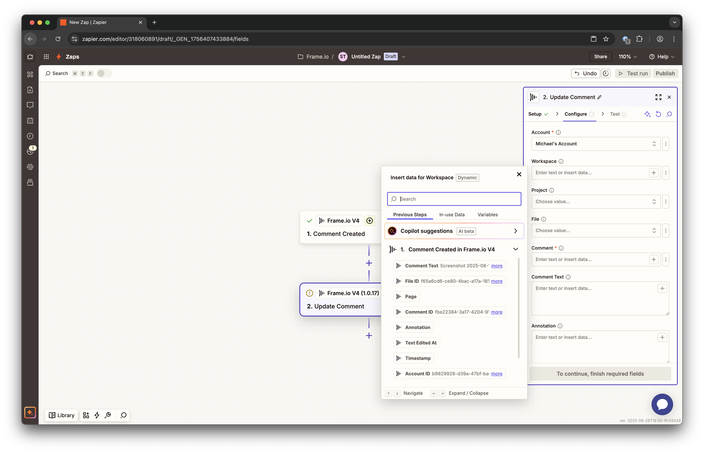

# Frame.io Resources in Zapier V4

## Navigating Resource Data

Frame.io's V4 API payloads are comprehensive and well-structured. When working with triggers like "File Created" or "Comment Created," you'll see many fields that provide rich context about the events and resources.

### Field Examples

Zapier's data input fields include a search function to help you quickly find the field you need. The V4 integration provides enhanced field mapping with cleaner, more descriptive labels.

## What to Look For

The following table reflects the V4 Zapier integration's actual field structure and available data:

### Asset/File Fields

| Resource type | Field in Zapier | Description |
|---------------|----------------|-------------|
| **File (all)** | `Original Download URL` | Direct download link to the original uploaded file. Use this for moving files into other systems. |
| **File (all)** | `High Quality Download URL` | Download link for high-quality proxy version (when available). |
| **File (all)** | `Thumbnail Download URL` | Download link for the file thumbnail. |
| **File (all)** | `Thumbnail URL` | Direct URL to the thumbnail image, great for adding visuals to project tracking tools. |
| **File (all)** | `File Name` | The complete filename including extension. |
| **File (all)** | `File Name (without extension)` | Just the filename without the file extension - useful for organizing. |
| **File (all)** | `File Extension` | The file extension (e.g., "mp4", "png", "pdf"). |
| **File (all)** | `File Type Category` | Categorized type: "video", "image", "audio", "document", or "other". |
| **File (all)** | `File Size` | Size in bytes. |
| **File (all)** | `Media Type` | MIME type (e.g., "video/mp4", "image/png"). |
| **File (all)** | `Status` | Current processing status of the file. |
| **File (all)** | `Creator Name` | Name of the person who uploaded the file. |
| **File (all)** | `Creator Email` | Email address of the file uploader. |
| **File (all)** | `Creator ID` | Unique ID of the file creator. |
| **File (all)** | `Project ID` | ID of the file's parent project. |
| **File (all)** | `Project Name` | Name of the project containing the file. |
| **File (all)** | `Parent Folder ID` | ID of the immediate parent folder. |
| **File (all)** | `View URL` | Direct link to view the file in Frame.io. |
| **File (all)** | `Created Date (YYYY-MM-DD)` | Creation date in YYYY-MM-DD format. |
| **File (all)** | `Created Time (HH:MM:SS)` | Creation time in HH:MM:SS format. |

### Comment Fields

| Resource type | Field in Zapier | Description |
|---------------|----------------|-------------|
| **Comment** | `Comment Text` | The text content of the comment. |
| **Comment** | `Comment ID` | Unique identifier for the comment. |
| **Comment** | `File ID` | ID of the file the comment was left on. |
| **Comment** | `Timestamp` | Frame number for time-based comments (for videos). |
| **Comment** | `Comment Author Name` | Full name of the person who left the comment. |
| **Comment** | `Comment Author Email` | Email address of the comment author. |
| **Comment** | `Comment Author ID` | Unique ID of the comment author. |
| **Comment** | `Project ID` | ID of the project containing the commented file. |
| **Comment** | `Project Name` | Name of the project. |
| **Comment** | `Workspace ID` | ID of the workspace containing the project. |
| **Comment** | `Annotation` | Additional annotation data (when applicable). |
| **Comment** | `Page` | Page number for document comments. |

### Project Fields

| Resource type | Field in Zapier | Description |
|---------------|----------------|-------------|
| **Project** | `Project Name` | The name of the project. |
| **Project** | `Project ID` | Unique identifier for the project. |
| **Project** | `Root Folder ID` | ID of the project's root folder. |
| **Project** | `Storage Usage` | Storage used by the project in bytes. |
| **Project** | `View URL` | Direct link to view the project in Frame.io. |
| **Project** | `Workspace ID` | ID of the workspace containing the project. |
| **Project** | `Account ID` | ID of the Frame.io account. |
| **Project** | `Owner Name` | Name of the project owner (when available). |
| **Project** | `Owner Email` | Email of the project owner (when available). |
| **Project** | `Owner ID` | ID of the project owner (when available). |

### Share Fields

| Resource type | Field in Zapier | Description |
|---------------|----------------|-------------|
| **Share** | `Share ID` | Unique identifier for the share. |
| **Share** | `Name` | Name/title of the share. |
| **Share** | `Access Type` | "public" or "secure" access level. |
| **Share** | `Short URL` | Shortened Frame.io URL for the share. |
| **Share** | `Commenting Enabled` | Whether comments are allowed on the share. |
| **Share** | `Downloading Enabled` | Whether downloads are allowed from the share. |
| **Share** | `Expiration Date` | When the share expires (if set). |
| **Share** | `Passphrase` | Password protection (if enabled). |

### Workspace Fields

| Resource type | Field in Zapier | Description |
|---------------|----------------|-------------|
| **Workspace** | `Workspace Name` | Name of the workspace. |
| **Workspace** | `Workspace ID` | Unique identifier for the workspace. |
| **Workspace** | `Account ID` | ID of the Frame.io account. |
| **Workspace** | `Creator Name` | Name of the workspace creator. |
| **Workspace** | `Creator Email` | Email of the workspace creator. |
| **Workspace** | `Creator ID` | ID of the workspace creator. |

## File URLs and Media Links

**File URLs are secure and direct**: The V4 integration provides direct links to Frame.io's asset storage. These URLs can and should be used in any Zapier workflow where you want to move files into other systems.

**Recommended approach**: When you have a choice between "File Attachment" and "File Attachment (URL)" in other apps, choose the URL option as it generally supports larger files and more file types.

**Available URL types**:
- `Original Download URL`: The original uploaded file
- `High Quality Download URL`: High-quality proxy (when available)  
- `Thumbnail Download URL`: File thumbnail
- `Thumbnail URL`: Direct thumbnail display link

## Available Triggers

The V4 integration supports the following webhook-based triggers:

### File Events
- **File Created**: Triggers when a file is first created (before upload completion)
- **File Ready**: Triggers when file processing is complete and file is ready for review
- **File Upload Completed**: Triggers when file upload finishes

### Comment Events
- **Comment Created**: Triggers when a new comment is added to a file
- **Comment Updated**: Triggers when an existing comment is modified
- **Comment Completed**: Triggers when a comment is marked as resolved/completed

### Project Events
- **Project Created**: Triggers when a new project is created

### Metadata Events
- **Metadata Value Updated**: Triggers when custom metadata field values change

## Available Actions

The V4 integration supports these create/update actions:

### File & Folder Management
- **Create Folder**: Create a new folder to a project
- **Upload File From URL**: Upload a file from a publicly available URL

### Comment Management
- **Create Comment**: Add a new comment to a file
- **Update Comment**: Modify an existing comment

### Workspace Management
- **Create Workspace**: Create a new workspace in an account
- **Create Share**: Create a new share link

## Search Actions

The V4 integration provides these search capabilities:

- **Show Comment**: Get comment details 
- **Find Project**: Search for projects by name
- **Show File**: Retrieve detailed file information
- **Show Project Details**: Get comprehensive project details