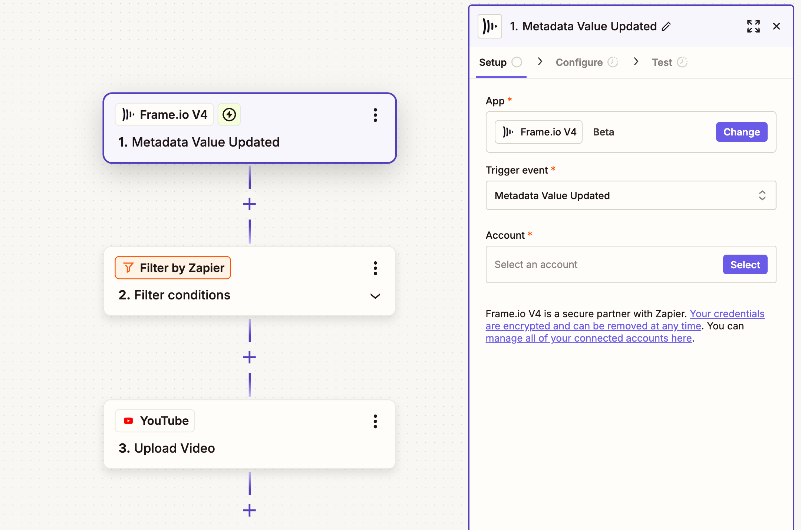

# How-To Guide

Getting started with Frame.io and Zapier is easy. This guide walks you through several examples of common workflows you can set up to automate your creative processes.

*Need to build something custom?* Jump directly to our [Building Custom Zaps](#building-custom-zaps) section below.

## Quick Start with Templates

The quickest method to get started is to use one of our pre-built templates. These templates provide ready-made workflows that you can customize for your specific needs. These are only a few popular workflow examples, more can be found [here](https://zapier.com/apps/frameio-v4/integrations).

## Monday.com to Frame.io Project Creation

*Automatically create Frame.io projects when new items are added to monday.com*

For busy production teams, setting up new Frame.io projects every time a task is added in monday.com can slow things down. This automation helps project managers skip the manual setup. Whenever a new item is created on a monday.com board, a matching Frame.io project is spun up instantly. It keeps creative workflows moving and gives media teams a head start on collaboration.

## Frame.io Approval to YouTube Publishing

*Automatically publish approved videos from Frame.io to YouTube*

Publishing final videos can become a bottleneck if approvals and uploads live in separate places. This automation takes care of that last step—once a video is marked as approved in Frame.io, it's automatically published to your YouTube channel. It's perfect for content teams who want to go live faster without chasing down files or repeating steps.

## Airtable to Frame.io Project Creation

*Automatically create Frame.io projects from new or updated Airtable records*

Managing creative projects in Airtable is flexible, but jumping over to Frame.io to set things up manually can break momentum. With this automation, anytime a record is added or updated in Airtable, a corresponding Frame.io project is created instantly. It's ideal for teams who track pre-production or briefs in Airtable and want a seamless handoff to post.

## Frame.io Project to Slack Channel Creation

*Automatically create dedicated Slack channels for new Frame.io projects*

For producers juggling multiple video projects, keeping team communication organized is a must. This automation creates a dedicated Slack channel as soon as a new Frame.io project is added—no need to manually set it up. It gives teams a shared space to collaborate from day one, so every project kicks off with structure and clarity.

## How to Use Templates

*Using templates is straightforward and saves you significant setup time:*

1. **Select a Template**: Choose from one of the pre-built templates that matches your workflow needs
2. **Configure Each Step**: For each step within the Zap, you'll go straight to the configure section *(setup is already done as per the template)*
   - With templates like *Airtable to Frame.io Project Creation* and *Frame.io Approval to YouTube Publishing* there are are several steps to fill out
3. **Add Your Information**: Input the required details like your account credentials, project names, folder locations, etc., depending on the type of workflow
4. **Test Your Zap** *(Optional)*: Run a test to make sure everything works correctly
   - *Important note*: Testing can sometimes be tricky, especially with webhook-based triggers
   - The testing step may show sample data that will be replaced by real data once you actually use the Zap
   - More information can be found in [Zapier's testing documentation](https://help.zapier.com/hc/en-us/articles/18811411817741-Test-Zap-steps)
5. **Publish**: Once you're satisfied with the configuration, click "Publish" to activate your Zap!

## Building Custom Zaps

*If you prefer to build a custom workflow from scratch or need something more specific than our templates offer:*

1. **Start a New Zap**: Go to the Zapier homepage and click "Create" then "New Zap"
2. **Select Your Trigger**: Choose the trigger action, which can be Frame.io or any other Zapier integration
   - *For Frame.io triggers*, see our [Frame.io Resources in Zapier V4](../Frame.io%20Resources%20in%20Zapier%20V4/) section for available triggers
3. **Complete Your Workflow**: Add the actions and configure the steps according to your specific needs
4. **Share Your Zaps**: *Remember* that Zaps can be shared with team members and collaborators for consistent workflows across your organization

## Tips for Success

- **Start Simple**: Begin with one of our templates to get familiar with how Frame.io and Zapier work together
- **Test Thoroughly**: *Always* test your Zaps before publishing, especially when working with file uploads or webhooks
- **Use Rich Data**: Take advantage of Frame.io's comprehensive data fields to create more intelligent automations
- **Plan for Scale**: Consider how your workflows will perform as your team and project volume grows

## Need More Help?

*Explore these additional resources:*

- Check out our [Frame.io Resources in Zapier V4](../Frame.io%20Resources%20in%20Zapier%20V4/) guide for detailed information about available triggers, actions, and data fields
- Visit the [Setting Up Zapier](../Setting%20Up%20Zapier/) guide for initial configuration steps
- Review our [Migration Guide](../Migrating%20from%20Legacy%20to%20V4/) if you're upgrading from an older integration

*Ready to automate your creative workflows?* Start with a template and customize it to fit your team's unique needs!
