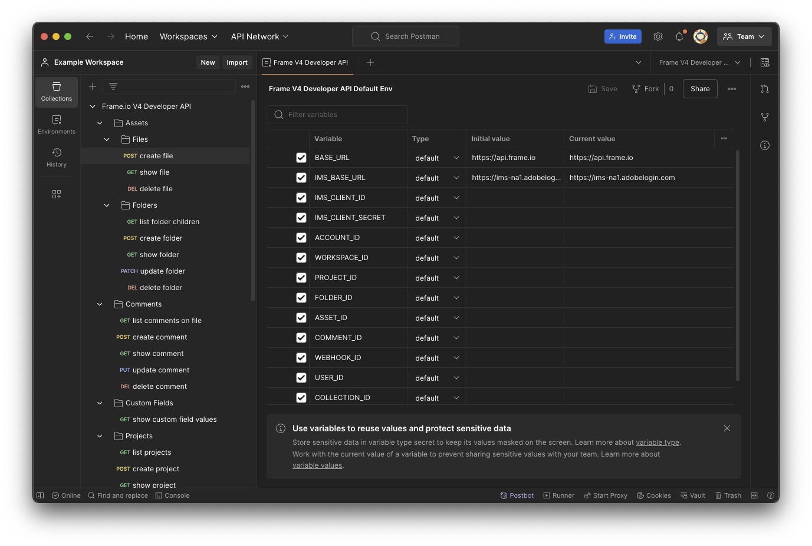
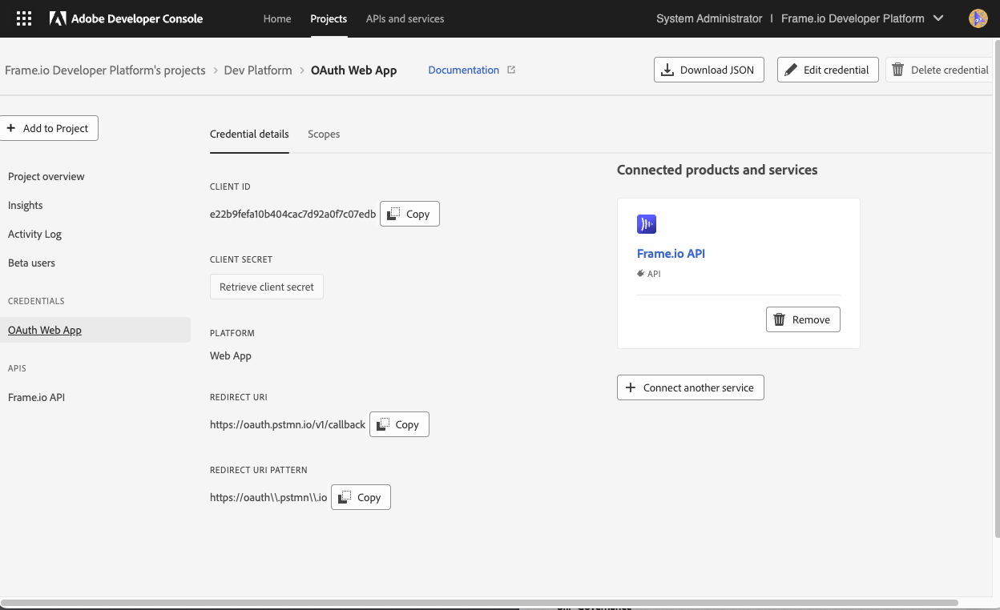
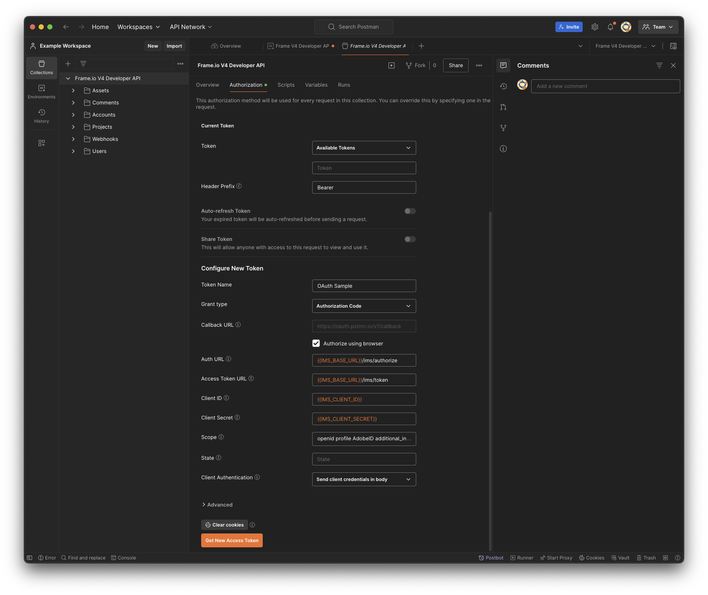
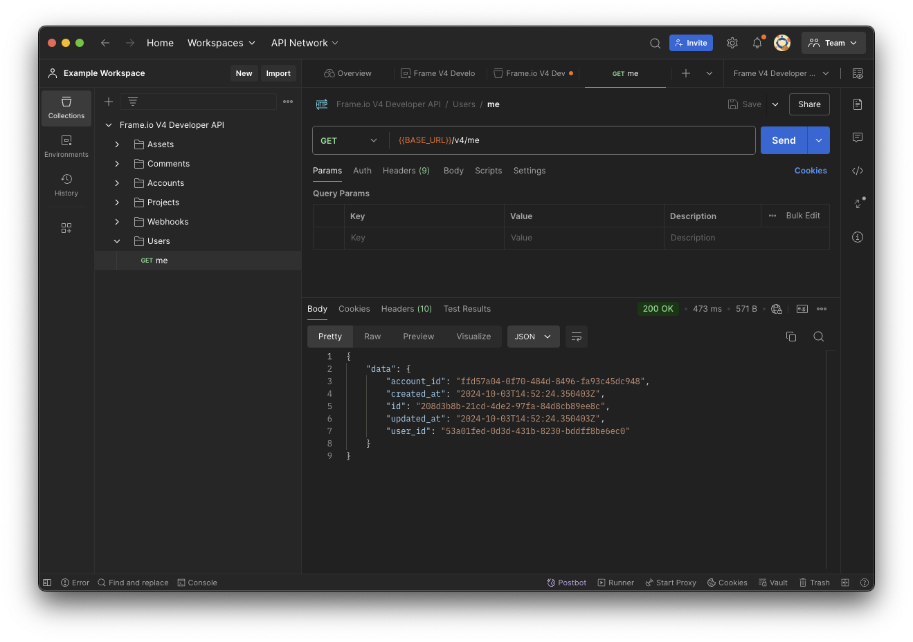
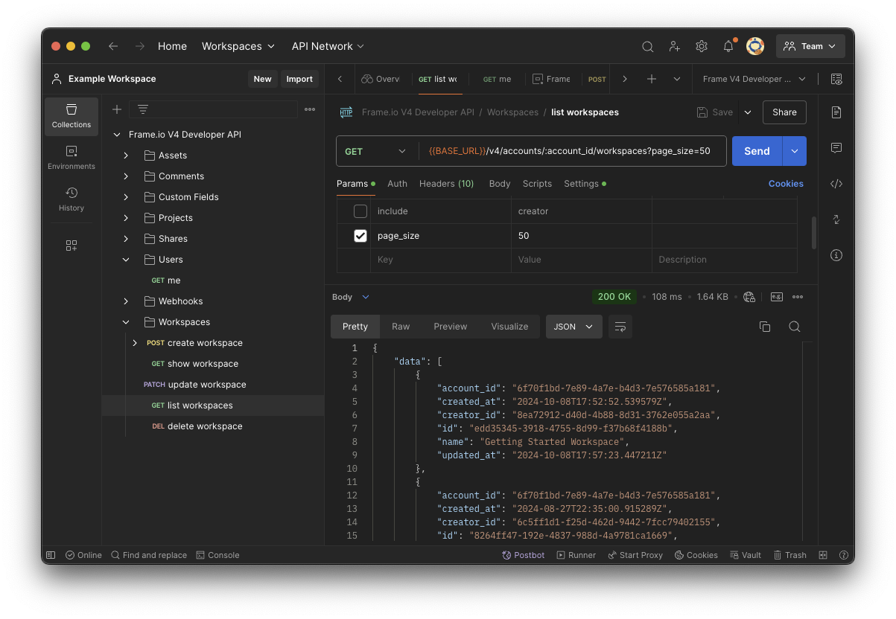
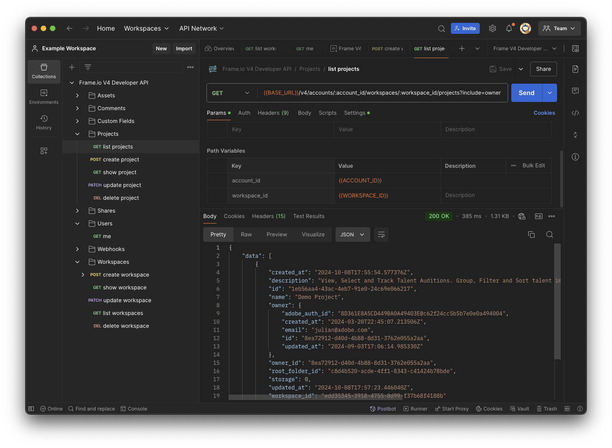
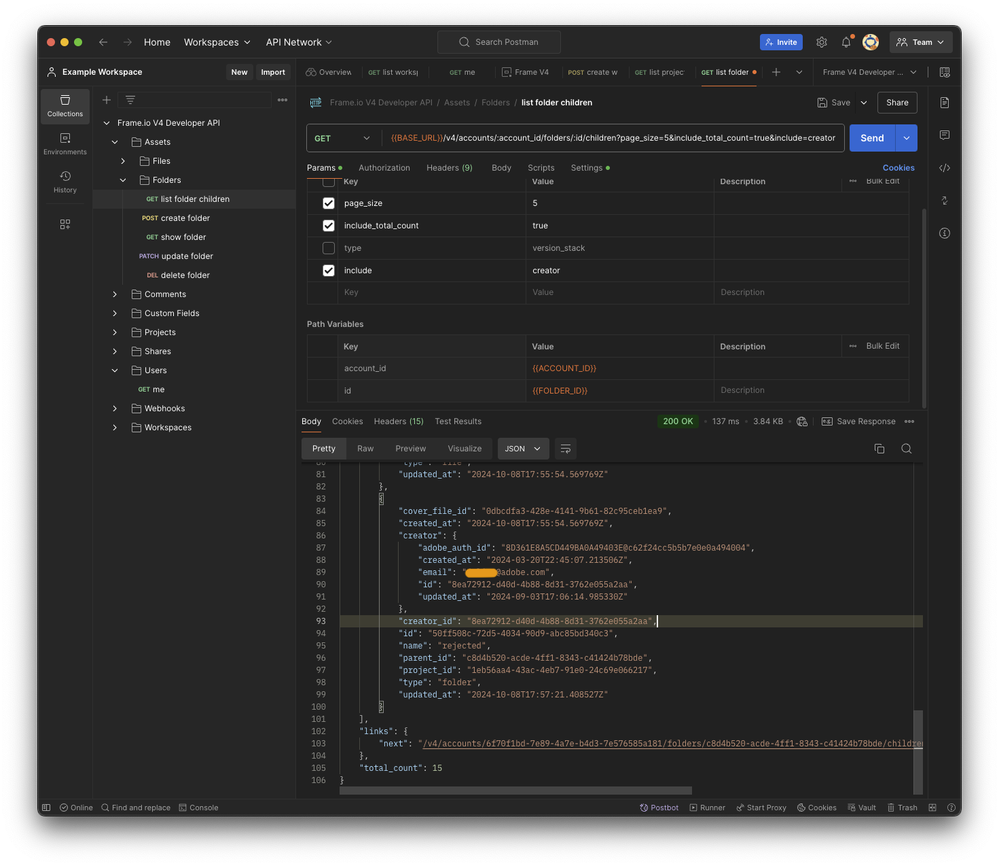
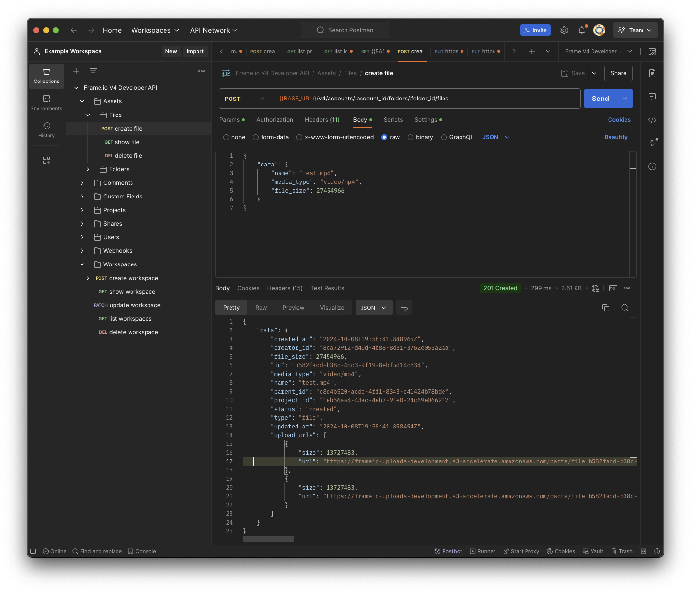
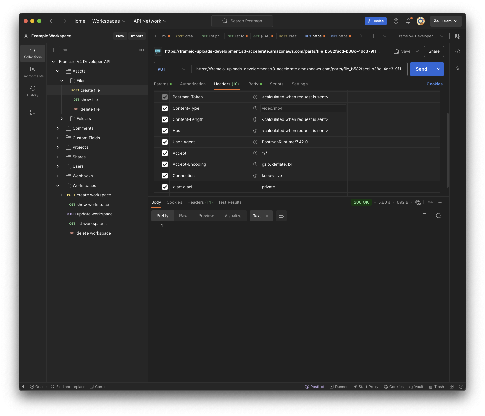

# Frame.io V4 API Getting Started Guide

## Adobe Developer Console

The first step in using an Adobe API is to create a **Project** in the Adobe Developer Console. Projects in the Developer Console correspond to an application you are building to consume the Frame.io Developer API. This is distinct from a project within Frame.io.

* Adobe Developer Console is the developer destination to access Adobe APIs & SDKs including the Frame.io API. Access it [here](https://developer.adobe.com/developer-console/).
* After creating a Project in the Developer Console, add the Frame.io API to it.  Access Projects in the Developer Console [here](https://developer.adobe.com/developer-console/docs/guides/projects/).

## What's New in the Frame.io V4 Developer API?

Just as the Frame.io application has been completely transformed for Version 4, the V4 API has also been redesigned from the ground up. Although some key concepts remain similar to legacy versions, many have been replaced or redesigned to support more powerful collaboration workflows and integrations. The introduction of a completely new API has also provided an opportunity to drastically simplify our operations and prioritize important customer workflows.

> A comparison between Frame.io V4 and the legacy version is [here](https://help.frame.io/en/articles/9084073-frame-io-v4-legacy-feature-comparison).

Within the V4 API, some resources, such as Workspaces (previously referred to as Teams in the legacy version of Frame.io), have been renamed in order to match Frame.io Version 4, while others, like Assets in the legacy version, have been renamed to refer to specific storage entities (Files, Folders, and Version Stacks) in order to reduce developer confusion. Still others, for example Custom Fields and Shares, are entirely new. Among other substantial changes, we have drastically pared down the amount of data returned by default for resource requests, renamed some property names in our responses to be more accurate and consistent across the entire API surface, and switched to a new, cursor-based pagination mechanism. As such, it is important to realize that, with the exception of the Camera to Cloud (C2C) API, clients that integrate with the legacy API are not compatible with the V4 API.

Additionally, some features remain in-progress and are expected to follow and evolve quickly in response to real-world customer use cases and feedback. Examples include the ability to create custom actions and version stacks. If a feature that was previously available in our legacy API appears to be missing, it’s quite likely that there is an alternative or that it will be available soon, but we’d like to hear from you about it.

Before diving into the V4 API it is helpful to first understand the core concepts expressed in the Frame.io Version 4 application. A good place to start is the [Frame.io V4 Knowledge Base](https://help.frame.io/en/). Concepts like Accounts, Users, Workspaces, Projects, Collections, Shares, and Custom Fields (Metadata) are modeled as distinct resources in the V4 API, and understanding their relationships and capabilities in the application will aid in understanding how they work in the V4 API.

## API Overview

The Frame.io V4 API is designed to follow RESTful architectural principles, and uses standard HTTP methods and response codes in conjunction with unique, resource-specific URLs. Frame.io publishes an [OpenAPI 3.0 specification](https://api.frame.io/v4/openapi.json) for our V4 API, which provides detailed information about its endpoints, request parameters, and responses. The OpenAPI spec can be consumed by a variety of third-party code-generation tools to facilitate rapid client application development.

### URL and Path Conventions

URL paths published in the OpenAPI specification generally reflect resource ownership and containment relationships. As such, some request parameters (e.g. account ids, folder ids, etc.) are embedded within the resource path. While these paths are intended to be predictable and easy-to-understand, the structure of some URLs returned by API requests (e.g. pre-signed upload URLs or display links) may be subject to change, and should never be composed directly by a client application.

### Request Query Parameters

Request parameters that control pagination behavior and the optional inclusion of related resources in response objects are defined as a standard set of query parameters: `include`, `page_size`, `include_total_count`. Some requests may support additional query parameters that are specific to that resource or operation.

```html
GET https://api.frame.io/v4/accounts/{account_id}/folders/{folder_id}/children?&include=project&page_size=5&include_total_count=true
```

### Request and Response Payloads

Request and response payloads both are composed as JSON objects, and, as such, the content-type header of an HTTP POST, PUT, or PATCH request must specify the `application/json` media type. When creating or updating resources, the `data` property of the request must contain the resource object. Attributes of the resource being created or updated are contained within this object. Similarly, successful responses that include resources will provide these within the `data` property of the response.

### Pagination

Responses that may potentially return large numbers of resource objects (e.g folder or comment listings) are paginated in order to reduce request latency as a result set grows large.. This means that the response to a request may only include a single “page” of results. As mentioned above, a client may choose a specific page size, up to a maximum of 100 elements through the `page_size` query parameter when making the request. If left unspecified, the page size will default to 50 elements. The V4 API uses a form of pagination known as *cursor-based pagination* and includes a relative link in the `links` property of the response object (see example below) that contains an opaque (clients should not attempt to construct this string themselves) cursor string in the `after` query parameter, which allows the client to retrieve the next page of results (see example response below) by making subsequent requests. At present, the V4 API only supports unidirectional pagination.

```json
{
    "data": [
        {
            "created_at": "2024-10-02T00:22:44.887775Z",
            "creator_id": "8ea72912-d40d-4b88-8d31-3762e055a2aa",
            "file_size": 102432,
            "id": "df171f3e-c95f-4454-9071-825cd924b572",
            "media_type": "application/pdf",
            "name": "sample.pdf",
            "parent_id": "e183c7ba-07d9-425a-9467-ebdf0223d9ce",
            "project": {
                "created_at": "2024-08-21T17:45:41.881596Z",
                "description": "For demonstration purposes",
                "id": "976dd413-a92b-4af6-b465-98aded0174a8",
                "name": "Demo Project",
                "owner_id": "8ea72912-d40d-4b88-8d31-3762e055a2aa",
                "root_folder_id": "e183c7ba-07d9-425a-9467-ebdf0223d9ce",
                "storage": 20881946,
                "updated_at": "2024-10-02T00:22:47.168489Z",
                "workspace_id": "378fcbf7-6f88-4224-8139-6a743ed940b2"
            },
            "project_id": "976dd413-a92b-4af6-b465-98aded0174a8",
            "status": "created",
            "type": "file",
            "updated_at": "2024-10-02T00:22:44.927993Z"
        }
    ],
    "links": {
        "next": "/v4/accounts/6f70f1bd-7e89-4a7e-b4d3-7e576585a181/folders/e183c7ba-07d9-425a-9467-ebdf0223d9ce/children?after=g3QAAAACZAAGb2Zmc2V0YQVkAAR0eXBlZAANb2Zmc2V0X2N1cnNvcg%3D%3D"
    },
    "total_count": 21
}
```

### Errors

In the event that an error occurs, the `errors` property in the response object will contain an array of one or more error objects that provide details about the error(s) that occurred. At present, batch operations are not supported by the V4 API so there are no cases where partial success and errors must be handled by the client.

```json
{
    "errors": [
        {
            "detail": "Unexpected field: foo",
            "source": {
                "pointer": "/data/foo"
            },
            "title": "Invalid value"
        }
    ]
}
```

The following table lists common status codes used by the V4 API.

|Status Code	|**Status**	|Description	|
|---	|---	|---	|
|200	|OK	|Request succeeded.	|
|201	|Created	|Resource was created.	|
|204	|No Content	|Resource was deleted. No response payload.	|
|400	|Bad Request	|The request was invalid, often due to a malformed or missing parameter or payload.	|
|401	|Unauthorized	|The Authorization token is missing or invalid.	|
|403	|Forbidden	|The Authorization token doesn’t have sufficient permissions for this request.	|
|404	|Not Found	|The requested resource doesn’t exist.	|
|422	|Unprocessable Entity	|The request payload and/or parameters are well-formed but are otherwise invalid, preventing execution of the request (largely interchangeble with 400 Bad Request).	|
|429	|Too Many Requests	|The request has exceeded our API rate limit for this account. See Rate Limiting section of the Getting Started guide for details.	|
|5xx	|Server Errors	|An unexpected error was reported by our server. Clients should be wait a minimum of 30 seconds before retrying the event and any automated retries should be limited and include a randomized interval in additonal to employing exponential back-off in successive requests.	|

**Note** You may also see a 403 returned if your account is locked; in this scenario we'll inform you of this via the response description. There are several conditions that could place your account in this state so you'll need to contact Frame.io support to learn more and get your account back into good standing.

### Authentication and Authorization

The V4 API relies on OAuth 2.0 and [Adobe Identity Management Server (IMS)](https://experienceleague.adobe.com/en/docs/commerce-admin/start/admin/ims/adobe-ims-integration-overview) to authenticate a user (AuthN) and generate access tokens on behalf of that user. An access token must be provided with each API request via the HTTP Authorization header (i.e. Bearer token authentication).
> **Note** [Token scopes](https://developer.adobe.com/developer-console/docs/guides/authentication/UserAuthentication/IMS/#scopes) generated by IMS are static, and that authorization (AuthZ), which determines what the user is allowed to do (and what operations can be performed by the API on behalf of that user), is determined by the roles and permissions granted to the user within Frame.io. See Getting Started with the Developer Console and Authentication Setup (under Start Developing with Postman) sections for more detail about generating and requesting access tokens.

### Versions and Backward-Compatibility

The Frame.io V4 API is *not* backward-compatible with earlier versions of Frame.io APIs and, generally, cannot be used to access or update resources contained within legacy accounts as there have been significant changes to the V4 concepts and data model. As such, the URIs associated with the V4 API all include a `/v4` path prefix. However, the V4 API is still evolving quickly and it is possible that new features may occasionally warrant breaking changes. More commonly, Frame.io will release new *additions* to the API that we consider to be experimental for some period of time, allowing us to receive and respond to customer feedback and usage metrics. Recognizing that backward-compatibility is a major concern for customers managing production-quality integrations with high uptime requirements, we are designing the V4 API to support an additional level of versioning via a custom HTTP header in order to allow clients to opt into using experimental endpoints, avoid breaking changes, and provide backward-compatibility guarantees within the V4 namespace. More details are forthcoming, but for now it is safe to assume that the initial release of the V4 API is considered to be stable and that it will be some time before we contemplate introducing breaking changes.

### Rate Limiting

All V4 API calls are rate-limited, and each API resource and operation is configured with its own limit, The limits range from as low as 10 requests per minute to as high as 100 requests per second. At present, each limit is enforced by *account,* but the policies and limits themselves are subject to change.

The V4 API uses a “[leaky bucket](https://wikipedia.org/wiki/Leaky_bucket)” algorithm of progressive rate limiting, in which limits refresh gradually during their allotted time window. In other words, there is not a concept of any hard cutoff after which limits refresh for a particular resource (i.e. "fixed" and "sliding window" enforcement strategies). Rather, remaining limits are constantly refreshing at a pace relative to a resource's limit and time window. Requests that exceed the rate limit for a particular endpoint will fail with a 429 HTTP error.

Our recommended strategy for responding to 429 errors is usually referred to as "exponential back-off."
In short:

* When receiving a `429`, pause for a period (at least one second) before retrying the request
* If another `429` is received, exponentially increase, or at least double, the previous wait period until normal function resumes

In order to determine the rate limits that apply to a particular request, clients may inspect the the following HTTP headers returned in the response:

|Header	|Value Description|
|---	|---	|
|`x-ratelimit-limit`	|The rate limit for this resource path, measured in requests.	|
|`x-ratelimit-remaining`	|The number of requests remaining in the current time window.	|
|`x-ratelimit-window`	|The time window for this resource path's limits, measured in milliseconds (ms).	|

## API Details

The definitive documentation to the V4 API is our [API Reference Guide](../api/current/), but understanding the resource hierarchy as modeled by the V4 API will be helpful before issuing your first requests.

### Resource Hierarchy

An [Account](https://help.frame.io/en/collections/8779087-account-settings) is typically associated with an organization and represents the fundamental resource that determines a subscription plan, content ownership, user roles / permissions, and Workspace organization. As such, the URL path to almost all of the endpoints in the V4 API include a prefix that identifies the Account in which the resource resides.

Workspaces (previously called Teams in the legacy version of Frame.io) and [Projects](https://help.frame.io/en/articles/9101006-project-settings) are used to organize both content and users, including who has access to what content.

The basic hierarchy of content resources within Frame.io is as follows:

**Account → Workspace → Project → Folder → Folder / Version Stack / File**

Every asset uploaded to Frame.io is ultimately represented as a [File](https://help.frame.io/en/articles/9436564-supported-file-types-on-frame-io), while [Folders](https://help.frame.io/en/articles/9101044-creating-folders) and [Version Stacks](https://help.frame.io/en/articles/9101068-version-stacking) are storage resources that act as containers and provide the foundation for a hierarchical storage model that supports versioned assets. Most users are already familiar with the basic concept of a Folder in Frame.io: it simply serves as unordered container of other storage resources (modeled as its `children`) and represents a node within the folder tree. Every Project has a unique root folder (identified by the `root_folder_id` key), which serves as the root of the folder tree in which all of a Project’s assets reside.

A Version Stack is an ordered container of Files. Its ordering is strictly linear and determines a version number for each of its children, but clients may reorder the Files within the version stack as they see fit. A File will always be a child of (contained within) exactly one Folder *or* Version Stack at any given time. Similarly, a Folder or Version Stack will always be a child of exactly one Folder (excluding the Project's root folder).

See the [API Reference Guide](../api/current/) for more detail about performing basic CRUD operations on Files and Folders stored within Frame.io. At present the V4 API only supports Version Stacks when listing the contents of a Folder, but endpoints for creating and updating Version Stacks are coming soon.

## Start Developing with Postman

Postman is a popular tool used by web developers for testing and interacting with APIs. This section covers the basics of configuring Postman for use with the V4 API and includes a prebuilt Postman collection that developers can use to get started.

### Prerequisites

1. You have downloaded [Postman](https://www.postman.com/downloads/).
2. You have followed the steps in [Getting Started with the Adobe Developer Console](https://developer.adobe.com/developer-console/docs/guides/getting-started/) to create an Adobe Developer Console Project with a Frame.io API subscription that has been configured with an OAuth Web App Credential. This example assumes the use of a OAuth Web App credential, but for real-world use make sure to choose the appropriate credential type for your application.

### Importing the Postman Collection

[](https://app.getpostman.com/run-collection/33150877-924315f2-cc62-45f5-8153-77ff2aaa9067?action=collection%2Ffork&source=rip_markdown&collection-url=entityId%3D33150877-924315f2-cc62-45f5-8153-77ff2aaa9067%26entityType%3Dcollection%26workspaceId%3D96681ae7-d9a4-4ba0-a6ae-391c3aeb1e8b#?env%5BDefault%5D=W3sia2V5IjoiQkFTRV9VUkwiLCJ2YWx1ZSI6Imh0dHBzOi8vYXBpLmZyYW1lLmlvIiwiZW5hYmxlZCI6dHJ1ZSwidHlwZSI6ImRlZmF1bHQiLCJzZXNzaW9uVmFsdWUiOiJodHRwczovL2FwaS5mcmFtZS5pbyIsImNvbXBsZXRlU2Vzc2lvblZhbHVlIjoiaHR0cHM6Ly9hcGkuZnJhbWUuaW8iLCJzZXNzaW9uSW5kZXgiOjB9LHsia2V5IjoiSU1TX0JBU0VfVVJMIiwidmFsdWUiOiJodHRwczovL2ltcy1uYTEuYWRvYmVsb2dpbi5jb20iLCJlbmFibGVkIjp0cnVlLCJ0eXBlIjoiZGVmYXVsdCIsInNlc3Npb25WYWx1ZSI6Imh0dHBzOi8vaW1zLW5hMS5hZG9iZWxvZ2luLmNvbSIsImNvbXBsZXRlU2Vzc2lvblZhbHVlIjoiaHR0cHM6Ly9pbXMtbmExLmFkb2JlbG9naW4uY29tIiwic2Vzc2lvbkluZGV4IjoxfSx7ImtleSI6IklNU19DTElFTlRfSUQiLCJ2YWx1ZSI6IiIsImVuYWJsZWQiOnRydWUsInR5cGUiOiJkZWZhdWx0Iiwic2Vzc2lvblZhbHVlIjoiIiwiY29tcGxldGVTZXNzaW9uVmFsdWUiOiIiLCJzZXNzaW9uSW5kZXgiOjJ9LHsia2V5IjoiSU1TX0NMSUVOVF9TRUNSRVQiLCJ2YWx1ZSI6IiIsImVuYWJsZWQiOnRydWUsInR5cGUiOiJkZWZhdWx0Iiwic2Vzc2lvblZhbHVlIjoiIiwiY29tcGxldGVTZXNzaW9uVmFsdWUiOiIiLCJzZXNzaW9uSW5kZXgiOjN9LHsia2V5IjoiQUNDT1VOVF9JRCIsInZhbHVlIjoiIiwiZW5hYmxlZCI6dHJ1ZSwidHlwZSI6ImRlZmF1bHQiLCJzZXNzaW9uVmFsdWUiOiIiLCJjb21wbGV0ZVNlc3Npb25WYWx1ZSI6IiIsInNlc3Npb25JbmRleCI6NH0seyJrZXkiOiJXT1JLU1BBQ0VfSUQiLCJ2YWx1ZSI6IiIsImVuYWJsZWQiOnRydWUsInR5cGUiOiJkZWZhdWx0Iiwic2Vzc2lvblZhbHVlIjoiIiwiY29tcGxldGVTZXNzaW9uVmFsdWUiOiIiLCJzZXNzaW9uSW5kZXgiOjV9LHsia2V5IjoiUFJPSkVDVF9JRCIsInZhbHVlIjoiIiwiZW5hYmxlZCI6dHJ1ZSwidHlwZSI6ImRlZmF1bHQiLCJzZXNzaW9uVmFsdWUiOiIiLCJjb21wbGV0ZVNlc3Npb25WYWx1ZSI6IiIsInNlc3Npb25JbmRleCI6Nn0seyJrZXkiOiJST09UX0ZPTERFUl9JRCIsInZhbHVlIjoiIiwiZW5hYmxlZCI6dHJ1ZSwidHlwZSI6ImRlZmF1bHQiLCJzZXNzaW9uVmFsdWUiOiIiLCJjb21wbGV0ZVNlc3Npb25WYWx1ZSI6IiIsInNlc3Npb25JbmRleCI6N30seyJrZXkiOiJGT0xERVJfSUQiLCJ2YWx1ZSI6IiIsImVuYWJsZWQiOnRydWUsInR5cGUiOiJkZWZhdWx0Iiwic2Vzc2lvblZhbHVlIjoiIiwiY29tcGxldGVTZXNzaW9uVmFsdWUiOiIiLCJzZXNzaW9uSW5kZXgiOjh9LHsia2V5IjoiV0VCSE9PS19JRCIsInZhbHVlIjoiIiwiZW5hYmxlZCI6dHJ1ZSwidHlwZSI6ImRlZmF1bHQiLCJzZXNzaW9uVmFsdWUiOiIiLCJjb21wbGV0ZVNlc3Npb25WYWx1ZSI6IiIsInNlc3Npb25JbmRleCI6OX0seyJrZXkiOiJBU1NFVF9JRCIsInZhbHVlIjoiIiwiZW5hYmxlZCI6dHJ1ZSwidHlwZSI6ImRlZmF1bHQiLCJzZXNzaW9uVmFsdWUiOiIiLCJjb21wbGV0ZVNlc3Npb25WYWx1ZSI6IiIsInNlc3Npb25JbmRleCI6MTB9LHsia2V5IjoiU0hBUkVfSUQiLCJ2YWx1ZSI6IiIsImVuYWJsZWQiOnRydWUsInR5cGUiOiJkZWZhdWx0Iiwic2Vzc2lvblZhbHVlIjoiIiwiY29tcGxldGVTZXNzaW9uVmFsdWUiOiIiLCJzZXNzaW9uSW5kZXgiOjExfV0=)

Fork or download the [public Postman collection](https://www.postman.com/adobe/workspace/frame-io-v4-public-api/collection/33150877-924315f2-cc62-45f5-8153-77ff2aaa9067?action=share&creator=33150877&active-environment=33150877-cffd66a8-23bd-4c50-8891-29157ead1185)

The Frame.io Developer API collection contains all the V4 API public endpoints. This default environment is a template that you can fork or duplicate within Postman. Use it to set up user-specific environment variables for testing, or you can also update it directly.

If you download the collection, once it and the environment are imported, you will see both within Postman. The environment contains default URLs for the BASE_URL and IMS_BASE_URL variables. Additional environment variables are empty and require your particular input.


### Authentication Setup

The `IMS_CLIENT_ID` and `IMS_CLIENT_SECRET` environment variables should be set to the values retrieved from the Credential page associated with your Project in the Adobe Developer Console.
Note that this example is using a OAuth Web App credential, which generates a client secret. Using this type of credential makes it easy to configure Postman so that it can automatically refresh access tokens and reduce friction during ongoing development, but typically this type of credential should only be used for web applications in which the client secret is never distributed within client code. Also note that this credential has been configured for use with Postman by setting the Redirect URI / Redirect URI Pattern values appropriately.

Once those environment variables have been set (**make sure to save these changes in your environment**), the next step is to select the root of the Frame.io V4 Developer API collection in Postman’s collection browser and navigate to the Authorization settings. Click the “Get New Access Token” button at the bottom of the dialog and a new browser window/tab should open and prompt you to authenticate with Adobe IMS. Once authenticated, the browser will redirect back to Postman, which will then store the Bearer token that it received. This token may be refreshed by clicking the “Refresh” link directly underneath the token field in the dialog once it has been populated.
In order to verify that your authorization configuration was successful, select the **GET me** endpoint located under Users in the Postman collections browser and click Send. If configured correctly and user authentication was successful then you should see a 200 response with some basic information about the authenticated user.

>**Note** Copy the `account_id` property within the response and copy this value (without the double quotes) to the `ACCOUNT_ID` environment variable in your Postman environment (reminder: always be sure to save your environment after making changes so that they are visible in your active environment when sending requests). The `account_id` is used as a path parameter for most of the V4 API requests.

### Retrieving Workspaces and Projects

Most of the resources that you’ll interact with using the V4 API are contained within a Project. Projects are organized and managed within a Workspace, so the first step to creating or listing a Project is to determine the Workspace ID that contains it. In order to retrieve a list of existing Workspaces that you have access to in the account you logged into, select the **LIST workspaces** endpoint in the Postman collection browser and click the Send button. If your `ACCOUNT_ID` environment variable has been properly set then you should receive a response containing a list of all available Workspaces.
Once you’ve identified the Workspace in which you plan to operate, copy the value of its `id` property to the `WORKSPACE_ID` environment variable and save your environment. You are now ready to request a list of Projects that you have access to within that Workspace. Select the **LIST projects** endpoint in Postman and click Send. The response will contain the list of Projects contained within the Workspace. Identify the Project in which you’d like to experiment, and copy its `id` value to the `PROJECT_ID` environment variable in your current Postman environment. Also copy the `root_folder_id` property to the `FOLDER_ID` property in your environment. When operating on the asset tree within a Project, many requests take the parent Folder ID of a resource as a path parameter. Setting this environment variable to refer to the root folder will allow you to make requests to operate on resources contained at the root level of the Project.


### Listing the Contents of a Project

Now that the `FOLDER_ID` has been set to the root folder of the Project, you will able to list the content stored within it. Select the “list folder children” endpoint and click the Send button to try it out. This is a good opportunity to experiment with some of the optional query parameters that you may include with some GET requests that return lists of resources. In the example below, query parameters have been added to limit the number of returned resources to 5 (`page_size=5`), include the total count of child resources (`include_total_count=true`) and to include information about the child resources’ creator (`include=creator`). More information about the query parameters supported by each endpoint can be found in the [API Reference Guide](../api/current/).

>**Note** Notice the `links.next` value in the response. For paginated responses, this value will be populated if there is more data to return. In this case the requested number of items per “page” was quite small (5) and there are 15 files and folders stored in the Project’s root folder (the `total_count` property in the response) so the client should use the relative URL contained within the `links.next` property to retrieve the next page of items. Be aware that in Postman, clicking on the link will create a new tab containing that request, but you’ll need to manually set the Auth Type (on its Authorization page) to “Bearer” and copy the auth token from the Authorization settings of the Frame.io V4 Developer API collection since the dynamically created request isn’t a child of the collection.
>**Note** The query parameters from the initial request aren’t propagated to the link, so you’ll need to manually append those query parameters again if you’d like to apply them to the request for the next page of data.

### Uploading a New File

Uploading a File to a Frame.io Project requires two or more requests. Select the **CREATE file** endpoint to demonstrate how to create a File asset in a Frame.io Project. The body of the POST request contains a resource that describes the destination file name, its media type, and its file size. If the request is successful then a placeholder File resource will be created without any content in the destination folder. The `status` property of the new File resource will be set to “created” to indicate that the file does not yet have any bytes and that uploading has not yet commenced.  The response will also include one or more `upload_urls` which consist of pre-signed URLs to which you can upload the file content in subsequent requests. The number of pre-signed URLs returned in the `upload_urls` array is determined based on the file size of the original file.

While experimenting in Postman it is often most convenient to choose a relatively small file (< 10 MB) to simplify the upload process by only requiring a single upload URL, but it’s also straightforward to write a small shell script to split up the source file into as many chunks as is required, and issue the same number of subsequent requests (as shown in the examples above and below) to upload larger files. There are several important details to note about sending the subsequent upload requests:

1. The HTTP request method must be PUT.
2. The `x-amz-acl` header must be included and be set to `private`.
3. The `Content-Type` header must match the `media_type` specified in the original “create file” request. This is true even when uploading the file as separate parts.

>**Note**  Postman typically sets this header on its own if the file selected (on the Body tab) has a file suffix associated with that media type (e.g. *.mp4).

Once all the parts have been uploaded to their respective upload URLs, the Frame.io media pipeline will automatically stitch together the parts (if there is more than one), process the upload (perform any appropriate transcoding and generate thumbnails, preview renditions, etc.), and update the `status` of the File to reflect any in-progress or pending operations. Depending on the size of the file, it may take some time before the Frame.io web application is updated to reflect the uploaded state of the File.
>**Note**  In a real-world application it is possible, and often faster, to issue the content upload requests concurrently (although operating systems and browsers will frequently throttle the number of simultaneous HTTP/1.1 connections to the same URL host in order to avoid overwhelming the server).

